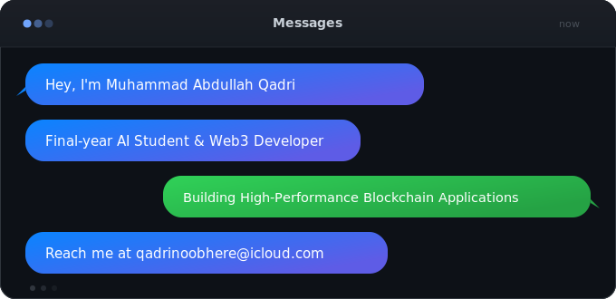

<!-- ═══════════════════════════════════════════════════════════════════════ -->
<!--  MUHAMMAD ABDULLAH QADRI — GitHub Profile README                       -->
<!--  Repo: github.com/CDes-QADRI/CDes-QADRI                                -->
<!-- ═══════════════════════════════════════════════════════════════════════ -->

<!-- HEADER WAVE -->

  

<!-- CHAT BUBBLE INTRO (iOS-style) -->

  

<!-- TYPING ANIMATION -->

  

<!-- SOCIAL BADGES -->

  &#8287;
  &#8287;
  &#8287;
  

<!-- PROFILE VIEWS + FOLLOWERS -->

  &#8287;
  &#8287;
  

---

##  About Me

- &#128302;&nbsp; I'm currently building a **decentralized application** for the **Arbitrum Buildathon** on [HackQuest](https://hackquest.io) &mdash; engineering scalable L2 solutions
- &#127793;&nbsp; Deepening expertise in **Machine Learning** and **Advanced Solidity Smart Contract Development**
- &#128107;&nbsp; Looking to collaborate on **Web3 / DeFi protocols**, **ML research**, and **open-source security tooling**
- &#9889;&nbsp; I daily-drive **Arch Linux** with **Neovim** &mdash; because true builders configure everything from scratch
- &#128231;&nbsp; Reach me at **qadrinoobhere@icloud.com**

---

## &#128202; GitHub Stats

  
  &nbsp;
  
  &nbsp;
  

  
  &nbsp;
  

  

  

---

## &#128736;&#65039; Tech Stack

<b>&#9981;&#65039; Blockchain &amp; Web3</b>

 

  
  
  
  
  

<b>&#129302; Languages &amp; AI/ML</b>

 

  
  
  

<b>&#128274; Cybersecurity &amp; Pentesting</b>

 

  
  
  
  

<b>&#128187; DevOps &amp; Environment</b>

 

  
  
  
  
  
  
  

 

<!-- TECH ICONS GRID — techstack-generator animated SVGs -->
<h3 align="center">💻 My Favorite Tools &amp; Technologies</h3>

<table align="center">
  <tr>
    <td align="center" width="96">
      
       Python
    </td>
    <td align="center" width="96">
      
       React
    </td>
    <td align="center" width="96">
      
       TypeScript
    </td>
    <td align="center" width="96">
      
       JavaScript
    </td>
    <td align="center" width="96">
      
       C++
    </td>
    <td align="center" width="96">
      
       Rust
    </td>
    <td align="center" width="96">
      
       Docker
    </td>
    <td align="center" width="96">
      
       Nginx
    </td>
  </tr>
  <tr>
    <td align="center" width="96">
      
       GitHub
    </td>
    <td align="center" width="96">
      
       Git
    </td>
    <td align="center" width="96">
      
       Linux
    </td>
    <td align="center" width="96">
      
       AWS
    </td>
    <td align="center" width="96">
      
       GraphQL
    </td>
    <td align="center" width="96">
      
       MySQL
    </td>
    <td align="center" width="96">
      
       Postgres
    </td>
    <td align="center" width="96">
      
       VS Code
    </td>
  </tr>
</table>

---

## &#128013; Contribution Snake

<picture>
  <source media="(prefers-color-scheme: dark)" srcset="https://raw.githubusercontent.com/CDes-QADRI/CDes-QADRI/output/github-snake-dark.svg"/>
  <source media="(prefers-color-scheme: light)" srcset="https://raw.githubusercontent.com/CDes-QADRI/CDes-QADRI/output/github-snake.svg"/>
  
</picture>

---

## &#129309; Let's Connect

  &#8287;
  &#8287;
  &#8287;
  

  <i>&laquo; Show me the code and I'll show you the future &raquo;</i>

<!-- FOOTER WAVE -->

  

